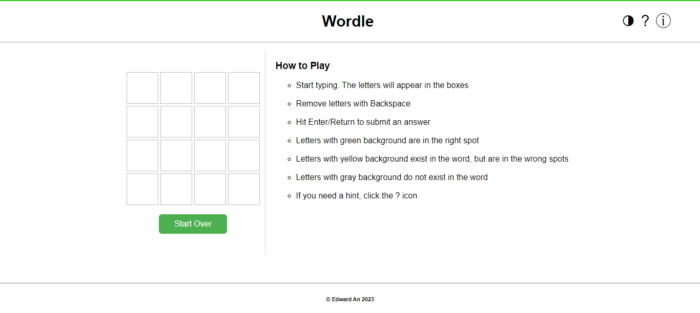
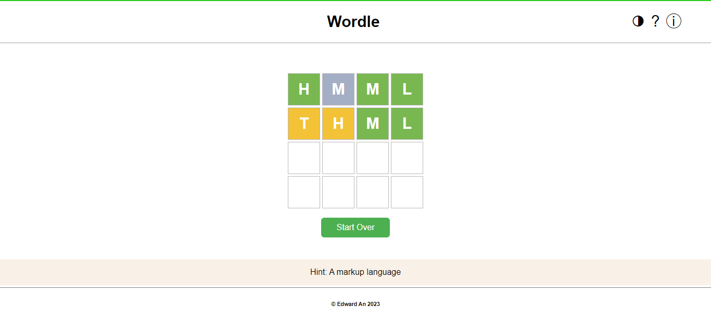
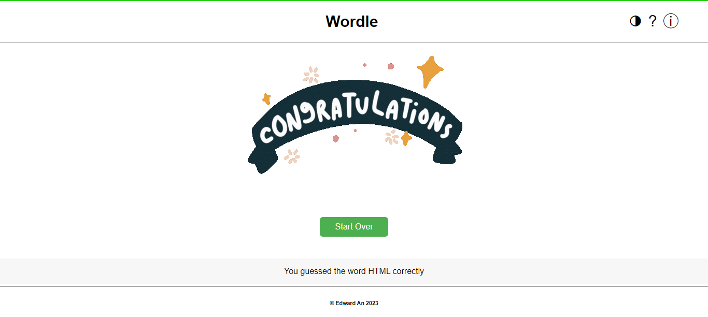
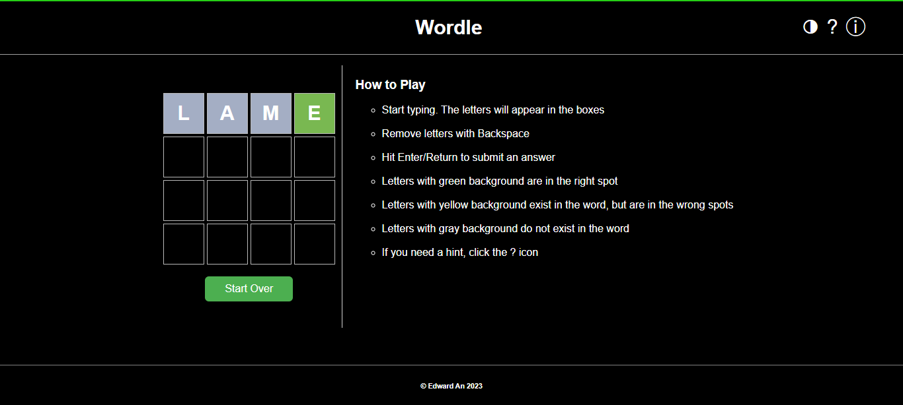

# Wordle-clone
This application is a clone of Wordle using HTML, CSS, and JavaScript.
The application reads a dictionary of words from this endpoint: `https://api.masoudkf.com/v1/wordle`. The endpoint requires an API key
(`sw0Tr2othT1AyTQtNDUE06LqMckbTiKWaVYhuirv`). The API is fetched using the following:

```js
    const res = await fetch("https://api.masoudkf.com/v1/wordle", {
        headers: {
        "x-api-key": "sw0Tr2othT1AyTQtNDUE06LqMckbTiKWaVYhuirv",
        },
    });
  ```
  
<br>
Since the API endpoint contains only four letter words, this wordle clone has 4 letter words unlike the original wordle game which has 5.

---

# How to run the program
In order to run the program, download the source files on your local machine:
- index.html
- style.css
- wordle.js

Once installed, the application can be ran by running index.html on localhost.

---

# What I learned
* Front end web development
* JavaScript DOM API
* The use of `fetch` function to call an API endpoint.
* CSS styling
* HTML Document Object Model

---
# Gameplay

The full game play is shown in the gameplay_video.mp4 file in the repository (download is required to view).

Keep scrolling for further explanations. 
<br>
The game instruction is shown when the user clicks on the `i` icon as shown below.


<br>

The game runs on the browser as shown below. The website generates a random word on the API for the user to guess and the user gets 4 attempts.
The hint shows up on the bottom of the page when the user clicks on the `?` icon.


<br>

When the user guesses the word correctly, the win screen appears.


<br>

There is a dark mode as well.

